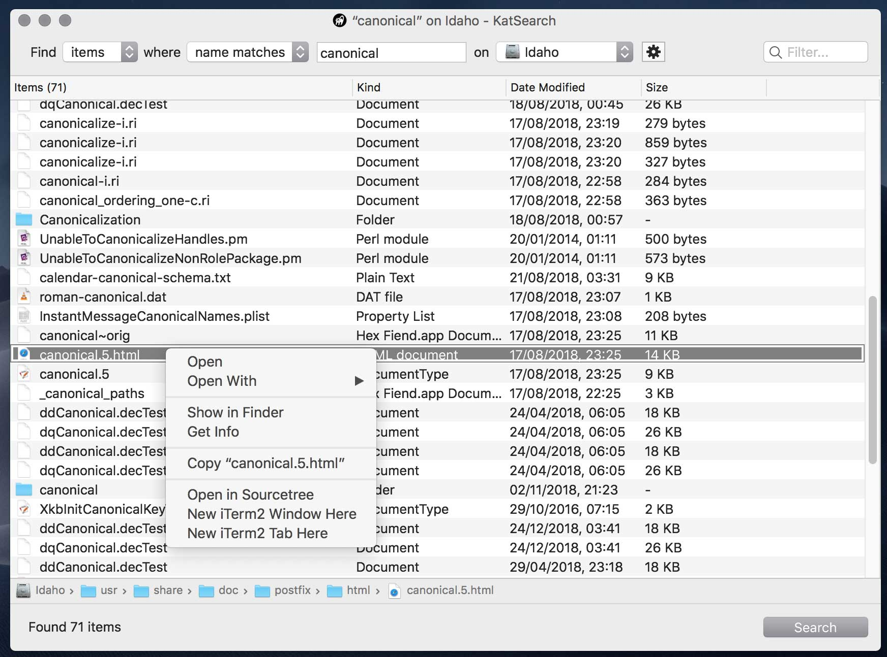

# KatSearch

**KatSearch is a work in progress**

Mac power-user app to quickly find files on entire HFS+/APFS volumes by scanning the file system catalog. 

Remember the good old days when search on the Mac simply scanned the filesystem? Yeah, me too, and I miss the simplicity of it. 

Unlike Spotlight, KatSearch performs no indexing and only looks at filenames, not content. It uses low-level kernel calls to search the **entire** file system via the APFS or HFS+ file system catalog.

* Fast, native, modern macOS app with a responsive, no-nonsense interface, written in Objective-C/Cocoa
* Live search results
* Scans the actual file system, not just userland files Apple wants you to see
* Can run with admin privileges to scan all files and folders on the volume irrespective of permissions
* Ubiquitous native drag and drop behaviour, with hooks into Finder actions/services
* Free, open source software

## Downloads

* No binaries on offer yet.

<!--
*  **[⇩ Download KatSearch 1.0](https://sveinbjorn.org/files/software/katsearch.zip)** (~1.5 MB, Intel 64-bit, 10.8 or later)
-->

## Screenshots

## BSD License 

Copyright (C) 2018-2019 Sveinbjorn Thordarson &lt;<a href="mailto:">sveinbjorn@sveinbjorn.org</a>&gt;

Redistribution and use in source and binary forms, with or without modification,
are permitted provided that the following conditions are met:

1. Redistributions of source code must retain the above copyright notice, this
list of conditions and the following disclaimer.

2. Redistributions in binary form must reproduce the above copyright notice, this
list of conditions and the following disclaimer in the documentation and/or other
materials provided with the distribution.

3. Neither the name of the copyright holder nor the names of its contributors may
be used to endorse or promote products derived from this software without specific
prior written permission.

THIS SOFTWARE IS PROVIDED BY THE COPYRIGHT HOLDERS AND CONTRIBUTORS "AS IS" AND
ANY EXPRESS OR IMPLIED WARRANTIES, INCLUDING, BUT NOT LIMITED TO, THE IMPLIED
WARRANTIES OF MERCHANTABILITY AND FITNESS FOR A PARTICULAR PURPOSE ARE DISCLAIMED.
IN NO EVENT SHALL THE COPYRIGHT HOLDER OR CONTRIBUTORS BE LIABLE FOR ANY DIRECT,
INDIRECT, INCIDENTAL, SPECIAL, EXEMPLARY, OR CONSEQUENTIAL DAMAGES (INCLUDING, BUT
NOT LIMITED TO, PROCUREMENT OF SUBSTITUTE GOODS OR SERVICES; LOSS OF USE, DATA, OR
PROFITS; OR BUSINESS INTERRUPTION) HOWEVER CAUSED AND ON ANY THEORY OF LIABILITY,
WHETHER IN CONTRACT, STRICT LIABILITY, OR TORT (INCLUDING NEGLIGENCE OR OTHERWISE)
ARISING IN ANY WAY OUT OF THE USE OF THIS SOFTWARE, EVEN IF ADVISED OF THE
POSSIBILITY OF SUCH DAMAGE.

The KatSearch application icon is copyright (C) [Drífa Thoroddsen](https://drifaliftora.is).
